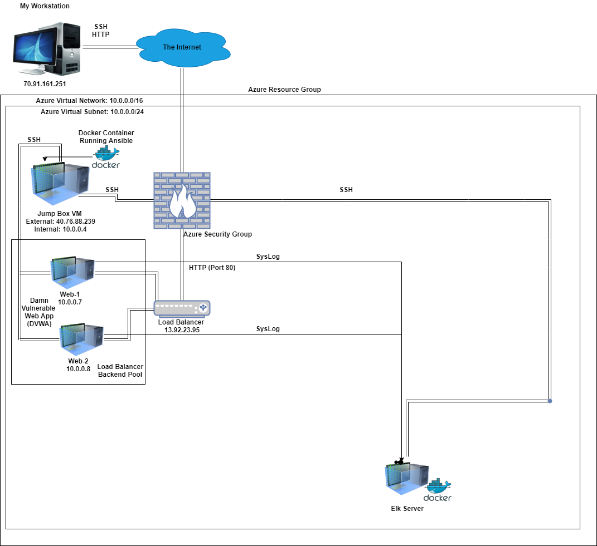
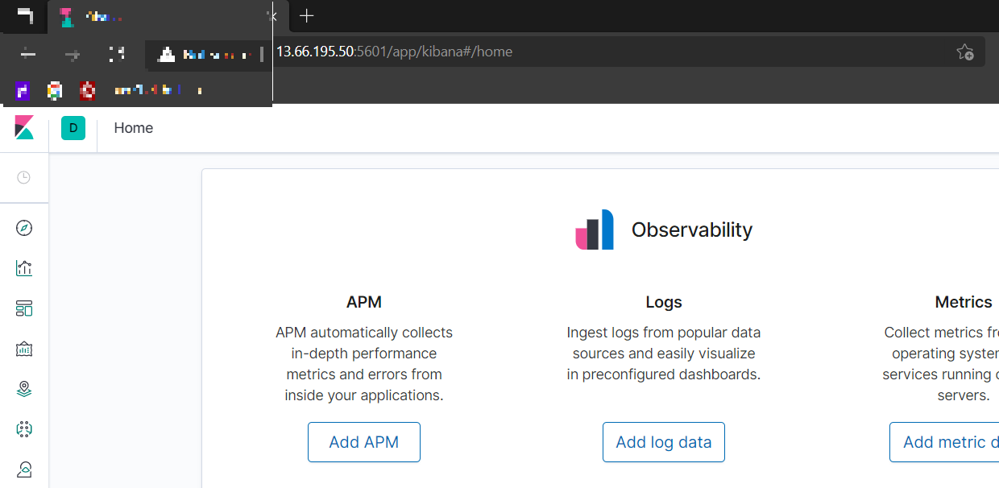

## Automated ELK Stack Deployment

The files in this repository were used to configure the network depicted below.

These files have been tested and used to generate a live ELK deployment on Azure. They can be used to either recreate the entire deployment pictured above. Alternatively, select portions of [elk.yml](https://github.com/MadT3ch/ELK-Stack-Project/blob/main/Ansible/elk.yml) and [filebeat-playbook.yml](https://github.com/MadT3ch/ELK-Stack-Project/blob/main/Ansible/filebeat-playbook.yml) may be used to install only certain pieces of it, such as Filebeat.

This document contains the following details:
- Description of the Topology
- Access Policies
- ELK Configuration
  - Beats in Use
  - Machines Being Monitored
- How to Use the Ansible Build

### Description of the Topology

The main purpose of this network is to expose a load-balanced and monitored instance of DVWA, the D*mn Vulnerable Web Application.

Load balancing ensures that the application will be highly **Available**, in addition to restricting **access** to the network.

Integrating an ELK server allows users to easily monitor the vulnerable VMs for changes to the **logs** and system **traffic**.

The configuration details of each machine may be found below.

Name | Function | IP Address | Operating System
-----| ---------|------------|-----------------
Jump Box | Jump Box | 10.0.0.4 | Linux
Web-1 | DVWA Web Server| 10.0.0.7 | Linux
Web-2 | DVWA Web Server| 10.0.0.8 | Linux
ELK-VM | Logging/Monitoring | 10.1.0.4 | Linux

### Access Policies

The machines on the internal network are not exposed to the public Internet. 

Only the **Jump Box** can accept connections from the Internet. Access to this machine is only allowed from the following IP addresses: 71.90.161.251

Machines within the network can only be accessed by the **Jump Box**.

A summary of the access policies in place can be found in the table below.

| Name     | Publicly Accessible | Allowed IP Addresses |
|----------|---------------------|----------------------|
| Jump Box | Yes              | 71.90.161.251 |
| Web-1         | No           |      10.0.0.4    |     
| Web-2         | No                    | 10.0.0.4 |
| Elk-VM        | No          | 10.1.0.4

### Elk Configuration

Ansible was used to automate configuration of the ELK machine. No configuration was performed manually, which is advantageous because using Ansible for provisioning, configuration management, and application deployment in an Infrastructure as Code (IAC) scenario accomplishes the following:
 - Automated Configuration
 - Configuration Management
 - It's agentless

The playbook implements the following tasks:
 - Curl the Filebeat Configuration file into the Ansible container
 - Edit configuration to include all servers involoved in implementation
 - Create Playbook considering Linux Filebeat installation
 - Run Playbook
 - Create inbound sercurity rule on the server to allow Port 5601

The following screenshot displays the result of running `docker ps` after successfully configuring the ELK instance.

### Target Machines & Beats
This ELK server is configured to monitor the following machines:
- 10.0.0.7
- 10.0.0.8

We have installed the following Beats on these machines:
- Filebeat
- 
These Beats allow us to collect the following information from each machine:
- Filebeat monitors and logs data that you allow and transfers them to Elasticsearch for review and retention.

### Using the Playbook
In order to use the playbook, you will need to have an Ansible control node already configured. Assuming you have such a control node provisioned: 

SSH into the control node and follow the steps below:
- Copy the filebeat-config.yml file to etc/ansible/files directory on the jump box
- Update the file to include the host IP for the ELK server (10.1.0.4) to port 9200 which is the API over HTTP that communicates with Elasticsearch
- Run the playbook, and navigate to the ELK-VM by running SSH to the Private IP (10.1.0.4) of the ELK Server
- The Playbook is the filebeat-playbook.yml that is copied to the etc/anisbile/files
- Update etc/ansible/filebeat-config.yml file in order to have Ansible run on a specific machine.
- Navigate to http://13.66.195.50:5601/app/kibana. If everything worked correctly you will see the web front end.
- **Note** Your ip address will differ slightly based on the public IP assigned by Azure.

- Run ssh KingAdmin@40.76.88.239
- **NOTE** If you used a different account name, you would use that here. 
- Run sudo docker container list -a to see the name of your container that you will start
- Run sudo docker container start happy_benz (*happy_benz* in my case. You could rename it by using docker rename **happy_benz** **ansible**)
- Run sudo docker container attach happy_benz (*happy_benz*)
- Get the SSH Key from the Ansible Container to copy into Jump Box cat ~/.ssh/id_rsa.pub
- Added this public key as a login option on your Azure VM
- Add new VM to hosts file using the python3-pip service <10.1.0.4> ansible_python_interpreter=/usr/bin/python
- Create Anible Playbook
